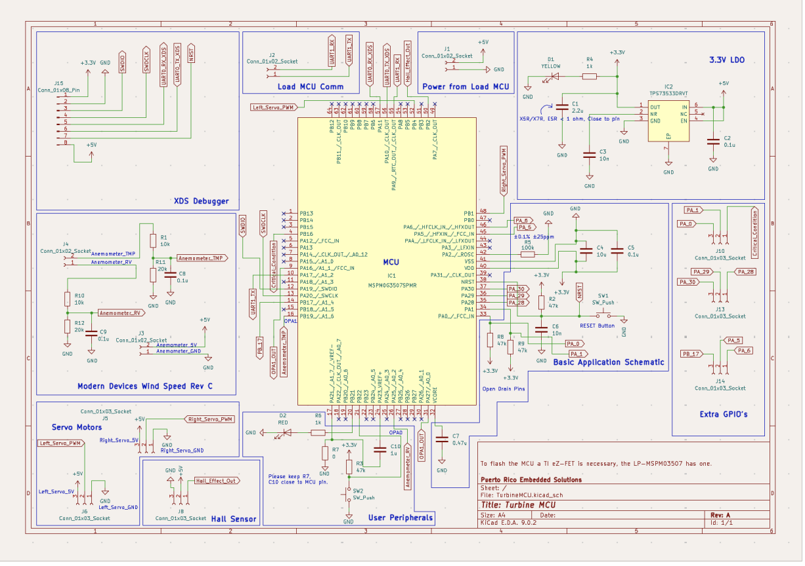
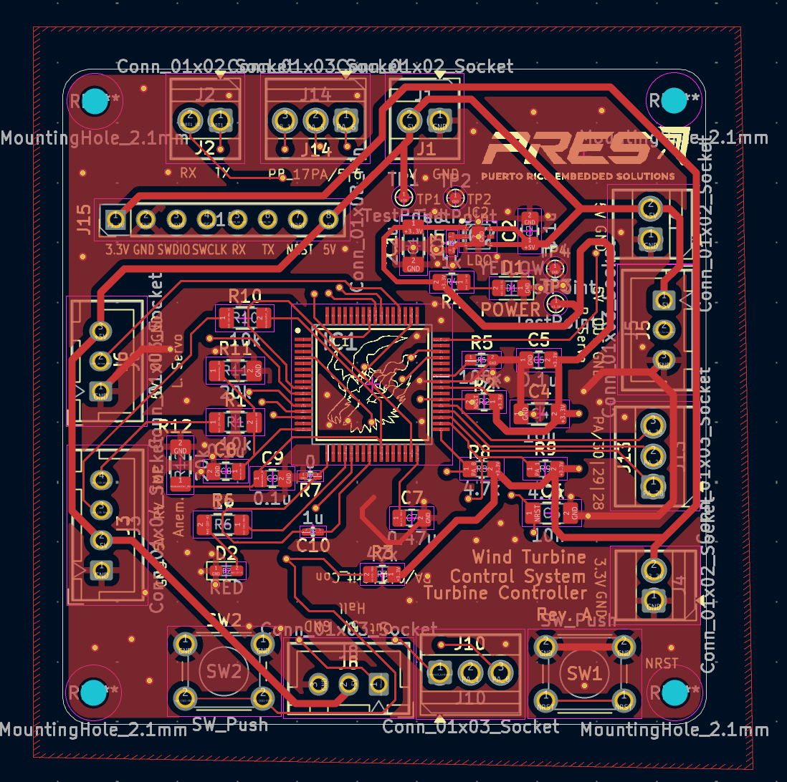
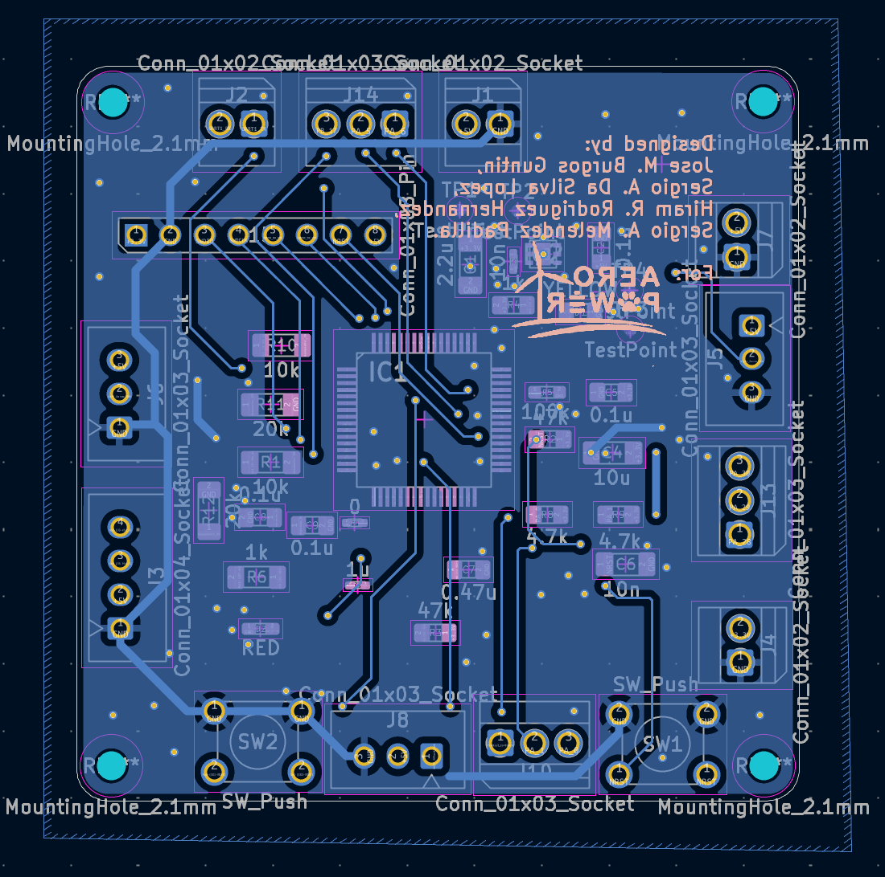
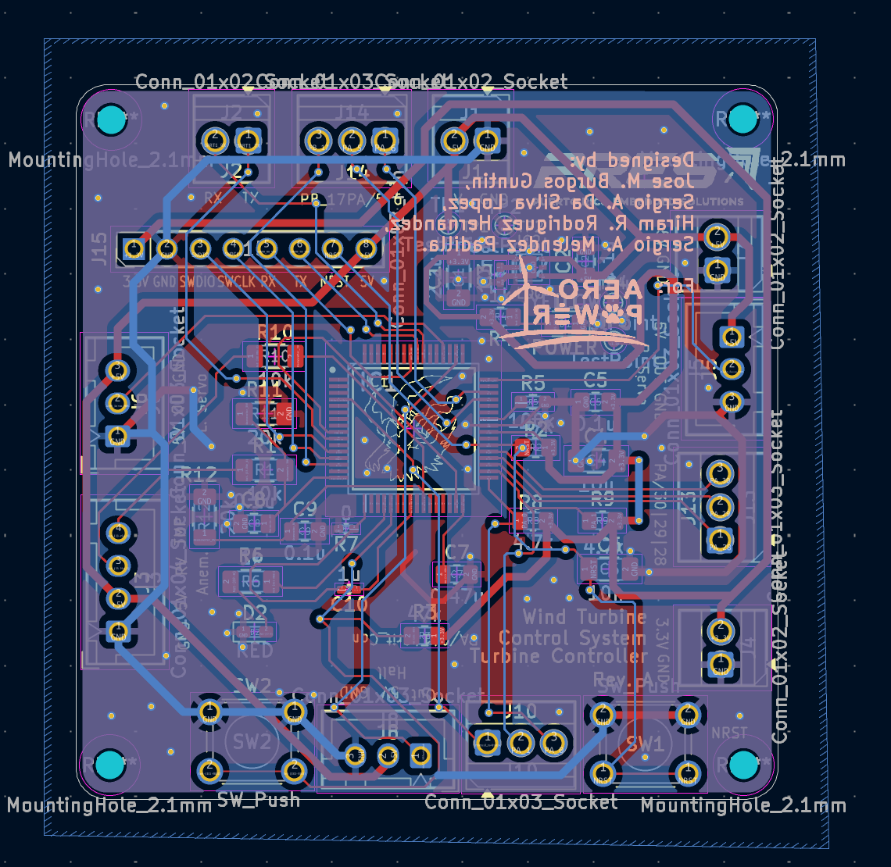
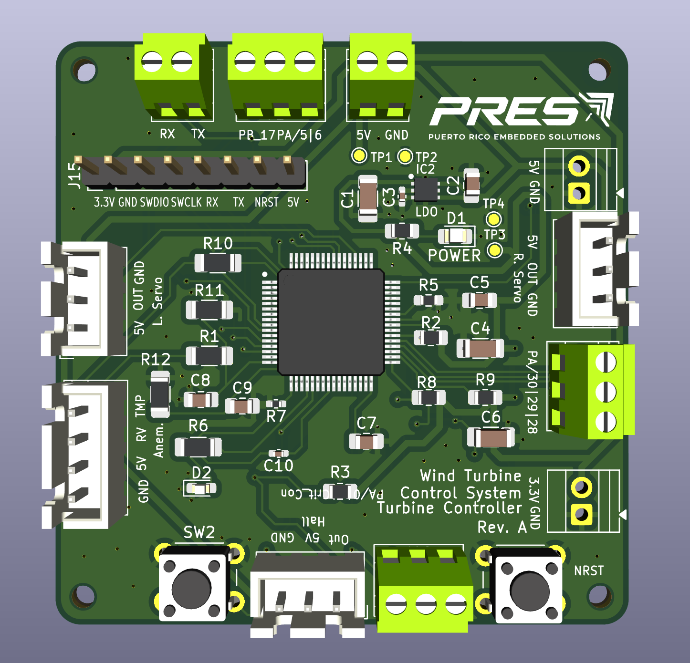

# Horizontal Axis Wind Turbine Electronic Control Unit (ECU)

## Turbine MCU PCB

Printed Circuit Board (PCB) design for the **Turbine Microcontroller Unit (MCU)** of the **Horizontal Axis Wind Turbine Electronic Control Unit (ECU)**.

This repository contains the complete KiCad hardware design, manufacturing files, and production documentation for the embedded controller responsible for turbine monitoring, blade pitch control, sensor acquisition, and communication with the Load Control & User Interface MCU.

---

# Documentation & Demo

| Resource | Link |
| ------------------------ | ------------------------------- |
| 🎥 Project Demonstration | https://www.youtube.com/watch?v=vS5Ok38P1Jk |
| 📄 Final Project Report | https://drive.google.com/file/d/1cckKhvj7mvzCEbm3IqWp0KvrUp9g6mgg/view?usp=sharing |
| 📚 Technical Appendix | https://drive.google.com/file/d/1xu7MtcffDlpna8_BUkwEc_BfjpQJpUep/view?usp=sharing |

---

# Overview

The Turbine MCU PCB serves as the dedicated embedded controller for the mechanical subsystem of the Horizontal Axis Wind Turbine Electronic Control Unit (ECU).

Designed using **KiCad**, this board interfaces directly with the turbine sensors and pitch actuation system, executing all real-time control tasks required for safe turbine operation. It operates alongside the Load Control & User Interface PCB, forming a distributed dual-MCU embedded architecture.

The PCB was designed with reliability, debugging, and manufacturability in mind, incorporating dedicated test points, modular circuitry, and production-ready manufacturing files.

---

# Engineering Highlights

- Custom 2-layer PCB
- Designed in KiCad
- Texas Instruments MSPM0G3507
- Dual servo motor interface
- Hall-effect sensor interface
- Hot-wire anemometer interface
- UART communication
- PWM generation
- Programming and debug header
- Dedicated test points
- Production-ready Gerber files
- Manufacturing BOM
- Pick-and-Place (CPL) files

---

# Hardware Features

The Turbine MCU PCB integrates the following subsystems.

### Turbine Monitoring

- Rotor RPM sensing
- Wind speed acquisition
- Sensor signal conditioning

### Pitch Control

- Dual servo motor outputs
- PWM control interface
- Blade pitch actuation

### Communication

- UART interface with the Load Control & UI MCU
- Programming and debugging interface

### System Management

- Local power regulation
- Test points
- Status indicators

---

# Hardware Architecture

The Turbine MCU PCB serves as the dedicated controller for the turbine's mechanical subsystem.

Primary responsibilities include:

- Wind speed acquisition
- Rotor speed measurement
- Blade pitch control
- Turbine state supervision
- Safety monitoring
- Communication with the Load Control & UI MCU

<p align="center">
  
</p>

<p align="center">
<b>Figure 1.</b> Turbine MCU Architecture
</p>

---

# PCB Design

The PCB was developed using KiCad following standard embedded hardware design practices.

Special consideration was given to:

- Servo routing
- Sensor integrity
- Ground plane implementation
- Test point accessibility
- Programming interface accessibility
- Manufacturing compatibility

## Top Layer

<p align="center">
  
</p>

<p align="center">
<b>Figure 2.</b> Top Layer PCB Layout
</p>

---

## Bottom Layer

<p align="center">
  
</p>

<p align="center">
<b>Figure 3.</b> Bottom Layer PCB Layout
</p>

---

## Combined Layer View

<p align="center">
  
</p>

<p align="center">
<b>Figure 4.</b> Combined PCB Layers
</p>

---

## 3D PCB View

<p align="center">
  
</p>

<p align="center">
<b>Figure 5.</b> 3D PCB Rendering
</p>

---

# Manufacturing Files

This repository contains all files required for PCB fabrication and assembly.

Included manufacturing assets:

- Gerber files
- Drill files
- Pick-and-Place (CPL)
- Bill of Materials (BOM)
- Complete schematic
- PCB layout

---

# Development Tools

## PCB Design

- KiCad

## Target MCU

- Texas Instruments MSPM0G3507

---

# Repository Structure

```text
HAWT-TurbineMCU-PCB
│
├── gerbers/                   Manufacturing Gerber files
├── images/                    Documentation images
├── mylib/                     Custom KiCad component library
├── TurbineMCU.kicad_pcb       PCB layout
├── TurbineMCU.kicad_sch       Main schematic
├── TurbineMCU.kicad_pro       KiCad project
├── TurbineMCU.kicad_sym       Custom symbols
├── TurbineMCU-all-pos.csv     Pick-and-Place (CPL)
├── TurbineMCU.csv             Manufacturing BOM
├── fp-lib-table               Footprint library configuration
├── sym-lib-table              Symbol library configuration
├── README.md                  Repository documentation
└── LICENSE                    Project license
```

---

# Related Repositories

| Repository | Description |
| ------------------------ | ---------------------------------------------------------------- |
| HAWT-TurbineMCU-Firmware | Embedded firmware for turbine monitoring and blade pitch control |
| HAWT-Load_Control_and_UI | Embedded firmware for battery charging, UI, and power management |
| HAWT-LoadUI-PCB | PCB design for the Load Control & UI MCU |

---

# Authors

- Hiram R. Rodríguez Hernández
- José M. Burgos Guntín
- Sergio A. Meléndez Padilla
- Sergio A. Da Silva López

Department of Electrical & Computer Engineering

University of Puerto Rico – Mayagüez

---

# License

This project was developed for educational and research purposes as part of the Embedded Systems Design course at the University of Puerto Rico – Mayagüez.
